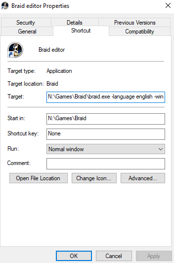

# Using arguments
Simplest way to pass arguments (AKA launch arguments) when launching any executable is to create it's shortcut, select it, right-click, then press "Properties", and edit "Target". Arguments are string values separated by spaces, and there should be space after path to .exe, like this:

Braid reads arguments without order, so to enable editor you just need to add `-editor` argument somewhere.

You can find full list of arguments here: [Launch Arguments](LaunchArguments.md)

I suggest reading [Creating Universe](CreatingUniverse.md) next.